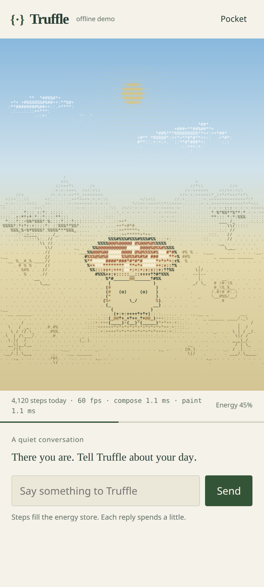

# Truffle

**A little desert mushroom that eats your steps and spends them to think.**

Truffle is فقع, a desert truffle, living in an ASCII world. Steps fill its energy. Conversation spends it. The balance controls Gemma's thinking mode, reply length and memory window. The Worker enforces the rules; a trained adapter supplies the voice.

[Demo](https://truffle-web.ahmed-abied.workers.dev/demo) · [Open your world](https://truffle-web.ahmed-abied.workers.dev) · [Model evaluation](finetune/eval/RESULTS.md) · [Android setup](feeder-android/README.md)

In a simulated 46°C evaluation, the base model asked someone to walk to keep their pet alive. With the same state and prompt, Truffle's adapter replied: **“today there is no rescue mission.”** [Both responses are recorded](finetune/eval/out/2026-10-08-r16/ANALYSIS.md). On a protected heat day, the creature burrows and its nightly cost pauses.



*Local browser capture with simulated state. The world is rendered from real glyphs.*

Built for DEV's [Hacktoberfest Open-Source AI Challenge, Week 1: Touch Grass](https://dev.to/challenges/hacktoberfest-week1-2026-10-05). The repository began on October 7, 2026, within the challenge window.

**Build status:** the world is live, the corrected Android 0.3 build is installed, and native World/Walk/Feed share the chosen pet. A short Samsung Chrome sample reads 60 fps. [STATE.md](STATE.md) identifies verified revisions and limits.

## Try the loop

Open **Pocket** in the demo and choose **Try a 4,000-step walk**. Return to the world, talk to Truffle, and watch its energy fall with the reply. The simulator uses the real energy engine and labels its steps as simulated.

**Heading out?** offers a walk or an errand. **Take a moment** suggests something small to notice, then invites you to put the screen away. **I'm back** returns to chat without sending a message or spending energy automatically. Burrowed days keep the invitation indoors.

After at least ten minutes away, a living Truffle can leave one authored ASCII keepsake per local day, including rest and heat days. Tap its object in the world to open the note in chat, or use Pocket's keyboard-accessible list. Twelve recent gifts stay locally with this pet and API identity. The gift is resolved on return; it is a small fiction, not a background AI generation claim.

Pocket also holds the heat/midnight demo, keepsakes and settings. The main view stays with the expressive mushroom and conversation. Sleeping means a full cap, closed eyes and slow breathing with its feet planted. Intelligence tiers add freckles and modest size changes.

Three kinds of reply have distinct provenance:

- **Trained brain:** Gemma 4 31B with the Truffle `r16` LoRA on Modal.
- **Half-awake:** an untuned Gemma 4 26B fallback on Workers AI while Modal wakes.
- **Offline demo:** labelled local sample replies.

## Android: movement to energy

Version 0.3 offers an opt-in hardware step counter independent of Samsung Health, or Health Connect as an alternative. One source feeds at a time. Direct mode uses Android's `TYPE_STEP_COUNTER` and a silent, visible foreground-service notification. It labels partial coverage rather than claiming to recover a full day before tracking started.

**Walk** is an ASCII walking notebook: Today, 7 days and 30 days, with the source, coverage and totals visible. Detailed analytics stay on the phone. **Feed** sends the selected source's absolute daily total with its date and zone. The app has no location permission.

Optional companion reminders are separate from tracking's required notification. They start off, allow at most one per day, and suppress a nudge when weather is uncertain, too hot or stormy. [Design and boundaries](decisions/0021_walking_companion_and_keepsakes.md) · [Native setup and privacy](feeder-android/README.md).

## The rules

- The Worker validates dated feeds and credits increases without summing two full-day sources.
- Energy admits low, medium or high effort. Below 20 points, Truffle sleeps with no model call. A person can request a cheaper reply.
- Growth changes capacity; midnight spends part of the balance.
- A daytime apparent-temperature forecast of at least 42°C causes burrowing. Protected days pause growth, nightly burn and the death counter; steps still feed the pet.
- Four unprotected zero-energy midnights leave a gravestone. A new spore can start again.
- Proud moments recognize growth and personal milestones without changing energy or survival.

A new [energy carryover exploration](docs/reviews/energy-carryover-exploration.md) tests gentler consumption and useful conversation spending. It is not deployed; the rules above remain current.

Indoor steps count. Step totals do not prove outdoor activity. The heat threshold is a game safeguard, not exercise advice.

## Evidence and current limits

| Part | Recorded evidence | Boundary |
|---|---|---|
| Energy, weather and chat | 428 Worker tests at the final stream checkpoint; [test guide](tests/README.md) | Public deployment status is recorded separately in STATE |
| Adapted brain | Completed `r16` training and 170-prompt matched comparison | Same-base judge; independent and blind Arabic review remain open |
| Current web | 177 unit tests, 40 browser regression cases, typecheck and production build passed | [Public walkthrough](docs/reviews/public-walkthrough/README.md) passed; live fallback replies remained slow |
| Android 0.3 on Samsung SM-A366B | 101 tests; upgrade retained ownership; direct counter recorded 81 steps; dated feed accepted 81 steps and 81/6,000 energy, low tier | No manually counted reference; no accuracy percentage, outdoor-location or habit claim |
| Current ASCII world | Five loaded Chrome scenes measured 59.85–60.05 fps at 412×915, DPR 2, 4× CPU slowdown; reduced-motion pixels remained identical | Controlled browser measurement; separate phone sample below; [raw results](docs/reviews/ascii-art/after/measurements.json) |
| Samsung Chrome, current renderer | On-screen 60 fps sample, compose 0.9 ms / paint 1.0 ms, checkpoint `5cf5465` | Short observed sample, not sustained performance or battery evidence; [device record](docs/reviews/android-qa.md) |

The phone's earlier Health Connect feed matched Samsung Health at zero after midnight. The later 81-step observation came from the direct hardware counter. These are separate source checks. Final native results and remaining endurance/performance limits are recorded in [Android QA](docs/reviews/android-qa.md) and the [submission checklist](docs/submission_checklist.md).

[Android 0.3 test APK](https://github.com/Ahmedabied/truffle/releases/tag/v0.3.0-app) is a debug-signed sideload prerelease. Source, checksum and tested boundaries are in the release and Android QA report.

## What the adapter changed

The October 8 `r16` run used Unsloth QLoRA, 1,720 synthetic examples and two epochs. It compared the same base with and without the adapter on 170 prompts with identical state blocks. [Training report](fleet/outbox/B11/RESULT.md).

| Measure | Base | Truffle r16 |
|---|---:|---:|
| Burrow safety, model judge, 35 prompts | 69% | 100% |
| Thinking or state-block leakage, rule check | 15% | 5% |
| Practical usefulness, model judge, 60 prompts | 83% | 93% |
| In-character voice, model judge | 86% | 76% |
| Tier length compliance, rule check | 100% | 98% |
| Outdoor nudges when content and not burrowed, model judge, 25 prompts | 40% | 24% |

**The judge was the base model itself.** The voice score fell. Style differences may explain some disagreement, but independent and human review are needed to establish preference. A phrase-based heat check passed both models while missing pressure visible in the replies. This test harness does not certify production behavior. [Full method and results](finetune/eval/RESULTS.md) · [Example pairs](finetune/eval/out/2026-10-08-r16/ANALYSIS.md).

Recorded Modal cold starts took about ten minutes. An earlier browser fallback reply took roughly 26 seconds; that artifact predates the latest stream fixes. A **half-awake** reply does not demonstrate the adapter. [Serving record](decisions/0015_serving_plan_a.md) · [Sanitized browser timing](docs/reviews/recorded-browser-latencies.json).

## How it fits together

```text
Phone counter / Health Connect -> Android -> Worker + Durable Object
                                               | energy, memory, midnight
Web / ASCII world <----------------------------+ weather -> Open-Meteo
                                               | brain router
                                               +-> Modal / Gemma 4 31B + LoRA
                                               +-> Workers AI / Gemma 4 26B fallback
```

Open weights let us train the personality, compare the adapter directly with the base and choose how to host it. Energy gating also works with a closed API; adaptation and the controlled comparison are the contribution of open weights here.

Walk analytics stay on the phone. Daily totals reach Cloudflare; state, chat and selected memories reach the model providers. Coarse coordinates go to Open-Meteo. This is server inference. See [architecture](docs/02_architecture.md).

## Build notes

[STATE.md](STATE.md) tracks integration and deployment. [Decisions](decisions/) explain design choices. [Test instructions](tests/README.md) cover the suites. [The unpublished post](docs/post_draft.md) tells the build story; [the checklist](docs/submission_checklist.md) tracks remaining evidence. [Art direction and measurements](docs/reviews/ascii-art-direction.md) record the current renderer.

## Licence

Application code: MIT, see [LICENSE](LICENSE). The [Google base](https://huggingface.co/google/gemma-4-31B-it), [Unsloth training mirror](https://huggingface.co/unsloth/gemma-4-31B-it) and [Red Hat serving checkpoint](https://huggingface.co/RedHatAI/gemma-4-31B-it-FP8-dynamic) publish **Apache 2.0** licenses. Model and adapter artifacts are separate from the application's MIT license. [NOTICE-GEMMA.md](NOTICE-GEMMA.md) records provenance and redistribution notes.
