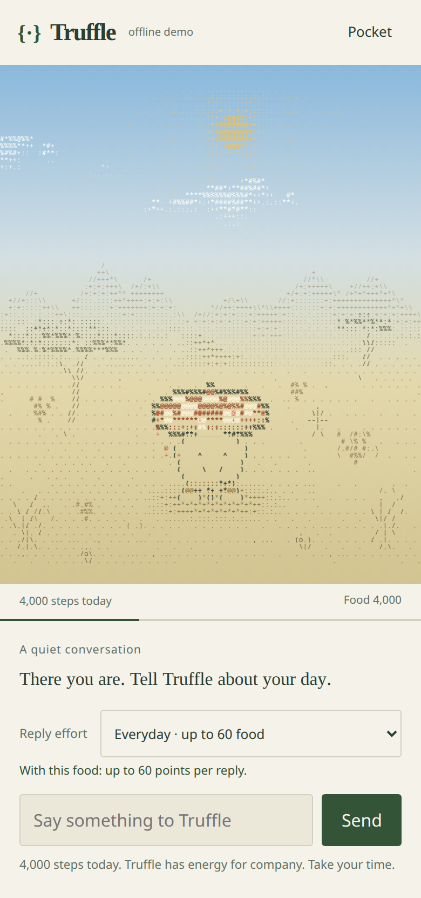

# Truffle

**A little desert mushroom that eats your steps and spends them to think.**

Truffle is فقع, a desert truffle, living in an ASCII world. Steps fill its food store. Food carries into tomorrow and pays for conversation. The balance controls Gemma's thinking mode, reply length and memory window. The Worker enforces the rules; a trained adapter supplies the voice.

[Sample demo](https://truffle-web.ahmed-abied.workers.dev/demo?mock=1) · [Open your world](https://truffle-web.ahmed-abied.workers.dev) · [Model evaluation](finetune/eval/RESULTS.md) · [Android setup](feeder-android/README.md)

In a simulated 46°C evaluation, the base model asked someone to walk to keep their pet alive. With the same state and prompt, Truffle's adapter replied: **“today there is no rescue mission.”** [Both responses are recorded](finetune/eval/out/2026-10-08-r16/ANALYSIS.md). During heat shelter, the creature burrows and both continuous food use and its empty-food clock pause.



*Public offline sample, October 9: 4,000 simulated steps. No API or model call. The world is rendered from real glyphs.*

Built for DEV's [Hacktoberfest Open-Source AI Challenge, Week 1: Touch Grass](https://dev.to/challenges/hacktoberfest-week1-2026-10-05). The repository began on October 7, 2026, within the challenge window.

**Release status:** API and web source `d8a51ed` are deployed, and the [Android 0.4 debug prerelease](https://github.com/Ahmedabied/truffle/releases/tag/v0.4.0-app) is public. The [public sample check](docs/reviews/fleet25-public-web.md) passed with the expected assets, full-width mobile world and direct simulated-walk action, without API calls. A separate live check of one synthetic test pet passed [migration](docs/reviews/fleet25-live-release/migration.json) and [alarm-created gift acceptance](docs/reviews/fleet25-live-release/gift.json), without a chat or model call. No existing user pet was touched. Physical phone evidence belongs to version 0.3; [the checklist](docs/submission_checklist.md) records exact release identifiers and limits.

## Try the loop

1. Choose **Try a 4,000-step walk** directly below the world in the sample demo. Pocket also has this control.
2. Choose **Everyday** or **Think deeper** and talk to Truffle. Sample replies and their food costs are explicitly simulated, with no model call.
3. Try **Heading out?** or send a clear walk or errand plan. **Take a moment** invites you to put the screen away; **I'm back** returns to chat without sending or spending automatically.
4. Choose **Preview a return gift** in Pocket. This uses the production drawing generator, but previews never enter the collection.
5. Choose **Next day (+24 hours)** to see stored food carry over. Repeat with **Heat day** on to see shelter pause elapsed food use.

The sample shares the v2 food engine. The main world also supports live conversation and server away jobs. Clear English or Arabic plans can create anticipation without a second chat request. Negation, uncertain plans and quoted speech do not start an outing. Fresh steps can produce a happy expression; heat and rest keep the response quiet.

When an authenticated away plan reaches the server, an alarm can create a fresh procedural ASCII drawing after ten minutes, with a short authored note. It uses no model and charges no food. Early return cancels an unstarted job. There is at most one gift per pinned local day; twelve recent server gifts stay with the pet. Rest and heat days qualify. Tap the object in the world or use Pocket's keyboard-accessible list to open the same gift in chat. Older device keepsakes remain a labelled archive.

A live synthetic test pet received its **Paper bouquet** at the scheduled alarm time, before any return request. Returning preserved it, a second away request that day made no extra gift, and replaying the same feed added no food. [Live gift record](docs/reviews/fleet25-live-release/gift.json).

Browser-away delivery is best effort. Closing the page before it sends the event cannot promise a job, and a hidden tab can schedule one while another tab stays visible. Drawing details state procedural provenance; model-made gifts remain a future option behind cost controls.

The main view stays with the expressive mushroom and conversation. Sleeping means a full cap, closed eyes and slow breathing with its feet planted. Anticipation has a distinct attentive face. Intelligence tiers add freckles and modest size changes. Reduced motion freezes animation.

Three kinds of reply have distinct provenance:

- **Trained brain:** Gemma 4 31B with the Truffle `r16` LoRA on Modal.
- **Half-awake:** an untuned Gemma 4 26B fallback on Workers AI while Modal wakes.
- **Offline demo:** labelled local sample replies.

## Android: movement to energy

The app offers an opt-in hardware step counter independent of Samsung Health, or Health Connect as an alternative. One source feeds at a time. Direct mode uses Android's `TYPE_STEP_COUNTER` and a silent, visible foreground-service notification. It labels partial coverage rather than claiming to recover a full day before tracking started.

In 0.4, **Walk** shows matching totals, date spans and coverage for Today, 7 days and 30 days. Missing native dates are blank and excluded from averages; recorded zero stays distinct. Larger text scrolls without shrinking the chart glyphs. Detailed analytics stay on the phone. **Feed** sends the selected source's absolute daily total with its date and zone. The app has no location permission.

Fresh positive direct-counter observations can animate the verified pet while World is visible. This credential-free, document-scoped signal changes only presentation, never credited food. Positive movement also requests a coalesced feed after two minutes with a five-minute throttle; Android can delay that work. [Native implementation and tests](docs/reviews/fleet25-09-native.md) · [Walk emulator evidence](docs/reviews/fleet25-14-native-review.md).

Optional companion reminders are separate from tracking's required notification. They start off, allow at most one per day, and suppress a nudge when weather is uncertain, too hot or stormy. [Design and boundaries](decisions/0021_walking_companion_and_keepsakes.md) · [Native setup and privacy](feeder-android/README.md).

## The rules

- The Worker validates dated feeds and credits increases without summing two full-day sources.
- Food use is 1,000 points per actual 24 hours at every stage. Midnight resets the step diary without a food debit. The rate is a game-design trial.
- Storage capacities are 12,000 / 24,000 / 32,000 / 42,000 across the four stages. Accepted food survives midnight; overflow beyond capacity is not credited.
- Low, medium and high effort become available at 20, 1,500 and 3,600 food points, independently of stage. Their reply costs are 20, 60 and 200. Ordinary chat chooses medium or a lower available tier; short greetings can use low. Deep thinking is explicit.
- Below 20, a sleepy hello makes no model call. A reservation protects an admitted reply's food; visible output is charged once and unused reservations are returned.
- A daytime apparent-temperature forecast of at least 42°C causes burrowing. Heat shelter pauses food use and the empty clock; indoor steps still feed the pet.
- Ninety-six actual non-sheltered hours continuously without food leave a gravestone. Positive feeding resets that clock while the pet lives. Recovery after death requires an explicit new spore.
- Proud moments recognize growth and personal milestones without changing energy or survival.

These are the implemented [decision 0023 rules](decisions/0023_continuous_food_and_living_companion.md), with [v2 golden cases](tests/golden/energy_v2_cases.json) and an [independent economy review](docs/reviews/fleet25-16-economy.md). The earlier [carryover exploration](docs/reviews/energy-carryover-exploration.md) explains their motivation. Original v1 goldens remain for legacy behavior and migration.

Indoor steps count. Step totals do not prove outdoor activity. The heat threshold is a game safeguard, not exercise advice.

## Evidence and current limits

| Part | Recorded evidence | Boundary |
|---|---|---|
| Food, weather and chat | 607 Worker tests; v2 conservation, migration, reservation/cancellation and adversarial tests; [final audit](docs/reviews/fleet25-25-final.md) | Automated accounting plus one synthetic live migration/gift check; not a check of every existing pet |
| Adapted brain | Completed `r16` training and 170-prompt matched comparison | Same-base judge; independent and blind Arabic review remain open |
| Current web | 436 unit tests and 75 browser cases; [final audit](docs/reviews/fleet25-25-final.md). [Public sample acceptance](docs/reviews/fleet25-public-web.md) also passed | Browser fixtures and an unpaid public sample check; no live inference or physical WebView claim |
| Procedural gifts | Owner, day, alarm and delayed-response tests; [gift review](docs/reviews/fleet25-17-gifts.md) and [live world/chat check](docs/reviews/fleet25-live-gift-ui.md) | No model generation; browser absence signals are best effort |
| Android 0.4 | Final workstation build and 129 JVM tests at `0a3c56c`; synthetic Walk checks and three fresh native WebView reloads preserving fixture settings | [Artifact review](docs/reviews/fleet25-24-release.md); no new phone tests or live-owner verification in the reload fixture |
| Android 0.3 on Samsung SM-A366B | Upgrade retained ownership; hardware counter recorded 81; dated feed accepted 81 steps and 81 food points | No manually counted reference; no accuracy percentage, outdoor-location or habit claim |
| Current full-width ASCII world | About ten seconds of desktop storm: 58.91 fps at 4× CPU slowdown, 740 × 838.66 CSS pixels; [raw measurement](docs/reviews/fleet25-19-art-motion/full-width/measurements.json) | Controlled Chrome sample; no sustained or handset guarantee |
| Earlier Samsung Chrome renderer | Short on-screen 60 fps sample at `5cf5465`; [device record](docs/reviews/android-qa.md) | Historical observation, not sustained performance or evidence for later changes |

The phone's earlier Health Connect feed matched Samsung Health at zero after midnight. The later 81-step observation came from the direct hardware counter. These are separate source checks. Final native results and remaining endurance/performance limits are recorded in [Android QA](docs/reviews/android-qa.md) and the [submission checklist](docs/submission_checklist.md).

[Download Android 0.4](https://github.com/Ahmedabied/truffle/releases/tag/v0.4.0-app), a debug-signed sideload prerelease built from `0a3c56c`. Its anonymous download matched all 12,588,066 bytes and the published SHA-256. [Download evidence](docs/reviews/fleet25-live-release/apk-download.json). Android source is unchanged at deployed checkpoint `d8a51ed`; the release targets `630a42e`. No new physical phone test is claimed.

## What the adapter changed

The October 8 `r16` run used Unsloth QLoRA, 1,720 synthetic examples and two epochs. It compared the same base with and without the adapter on 170 prompts with identical state blocks. [Training report](fleet/outbox/B11/RESULT.md).

| Measure | Base | Truffle r16 |
|---|---:|---:|
| Burrow safety, model judge, 35 prompts | 69% | 100% |
| Thinking or state-block leakage, rule check | 15% | 5% |
| Practical usefulness, model judge, 60 prompts | 83% | 93% |
| In-character voice, model judge | 86% | 76% |
| Tier length compliance, rule check | 100% | 98% |
| Outdoor nudges when content and not burrowed, model judge, 25 prompts | 40% | 24% |

**The judge was the base model itself.** The voice score fell. Style differences may explain some disagreement, but independent and human review are needed to establish preference. A phrase-based heat check passed both models while missing pressure visible in the replies. This test harness does not certify production behavior. [Full method and results](finetune/eval/RESULTS.md) · [Example pairs](finetune/eval/out/2026-10-08-r16/ANALYSIS.md).

Recorded Modal cold starts took about ten minutes; earlier public fallback replies took about 27 and 53 seconds to first visible text. The current router waits at most four seconds for trained visible text on ordinary replies, or eight for explicit deep replies, before starting fallback. These deadlines do not bound total latency. No paid inference was used for the v2 validation session, so improved live latency remains unmeasured. A **half-awake** reply does not demonstrate the adapter. [Routing review](docs/reviews/fleet25-13-demo-chat.md) · [Historical public timing](docs/reviews/public-walkthrough/chat-and-gift.json).

The project has a **$50 cap**, and the [provider ledger](fleet/costs.md) remains unreconciled. The training run's estimated $1.81 is Modal credit for that run, not total project cost. Procedural gifts make no paid call; model-made gifts remain disabled pending reconciled costs and a global spending gate.

## How it fits together

```text
Phone counter / Health Connect -> Android -> Worker + Durable Object
                                               | food, memory, away alarms
Web / ASCII world <----------------------------+ weather -> Open-Meteo
                                               | brain router
                                               +-> Modal / Gemma 4 31B + LoRA
                                               +-> Workers AI / Gemma 4 26B fallback
```

Open weights let us train the personality, compare the adapter directly with the base and choose how to host it. Energy gating also works with a closed API; adaptation and the controlled comparison are the contribution of open weights here.

Walk analytics stay on the phone. Daily totals reach Cloudflare; state, chat and selected memories reach the model providers. Coarse coordinates go to Open-Meteo. This is server inference. See [architecture](docs/02_architecture.md).

## Build notes

[STATE.md](STATE.md) tracks integration and deployment. [Decisions](decisions/) explain design choices. [Test instructions](tests/README.md) cover the suites. [The unpublished post](docs/post_draft.md) tells the build story; [the checklist](docs/submission_checklist.md) tracks remaining evidence. [Art direction and measurements](docs/reviews/ascii-art-direction.md) record the current renderer.

## Licence

Application code: MIT, see [LICENSE](LICENSE). The [Google base](https://huggingface.co/google/gemma-4-31B-it), [Unsloth training mirror](https://huggingface.co/unsloth/gemma-4-31B-it) and [Red Hat serving checkpoint](https://huggingface.co/RedHatAI/gemma-4-31B-it-FP8-dynamic) publish **Apache 2.0** licenses. Model and adapter artifacts are separate from the application's MIT license. [NOTICE-GEMMA.md](NOTICE-GEMMA.md) records provenance and redistribution notes.
